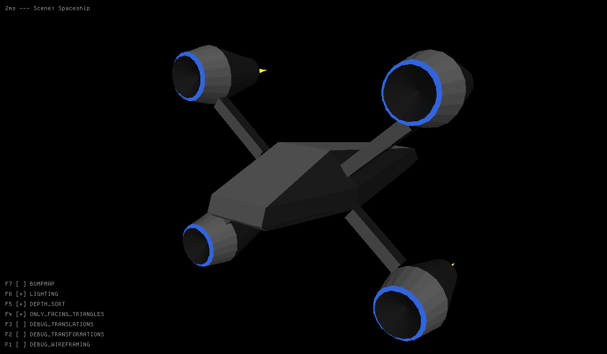
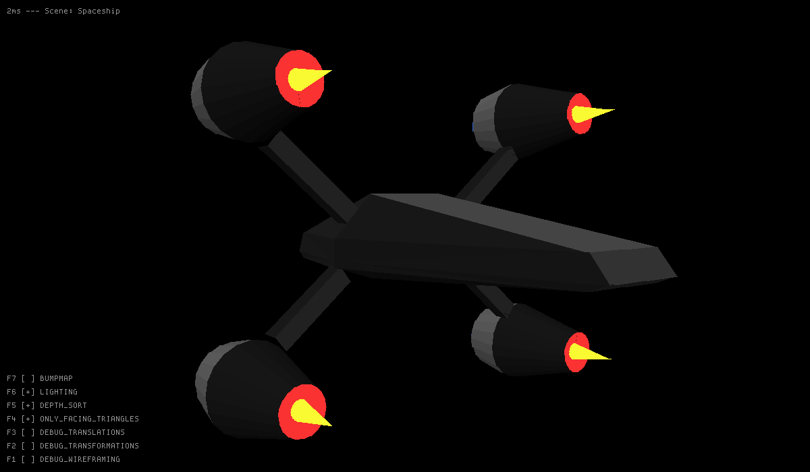
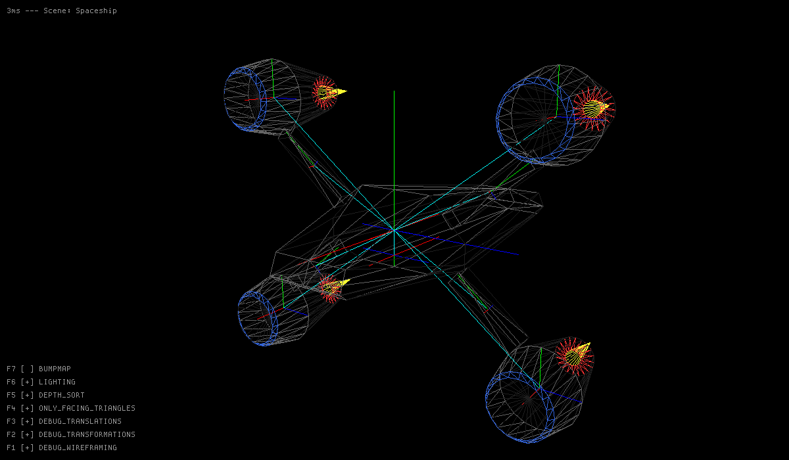
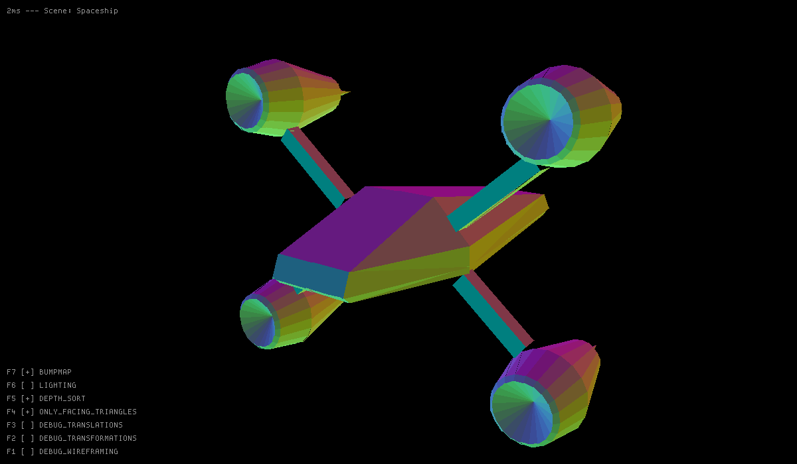

# Screenshots

Here you can see some screenshots of the showcase program utilizing the library. Pay attention to the texts on the images. You can see how much time the frame rendering took in the top left corner.

## Spaceship

This is a very simple model created within the demo program itself. *(An object file format and loader is planned, but this object is created programatically at this time.)*

As you can see in the bottom left corner, there are some features that can be toggled, which change the output significantly. Most are for debug purposes though.

Turning off the "lighting/shading" gives us uniformly colored surfaces, which makes the spaceship lose its 3D appearance.

Turning on the wireframing and some debug options we can see each objects' translation and transformation, each one originating from the absolute center (or its parent's center). Objects can be arranged in a tree-like structure, each object having its sub-objects. Transforming and translating these parent objects affect their childrens' position, size and rotation.

Another debug feature is the "bumpmap" shader, which changes every triangles' color based on its facing direction. This gives objects a colorful look.

## Icosahedron

There are some screenshots in this directory of an icosahedron, which can be refined endlessly, making it more and more spherical.
